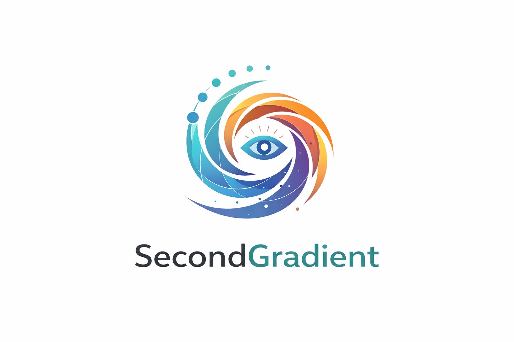

# SecondGradient


<p align="center">
  
</p>

### **Early-warning observability for production ML systems**

### Logo Philosophy

The SecondGradient mark represents continuous motion around a stable observer.
The eye symbolizes observability.
The spiraling gradient reflects accelerating change — not just drift, but the dynamics behind it.

SecondGradient is a monitoring and remediation framework for machine learning systems that focuses on **how change evolves over time**, not just when it crosses a threshold.

Most ML monitoring tools detect drift *after* it becomes visible.  
SecondGradient detects **acceleration in drift, degradation, and instability**—when there is still time to act.

---

## Why SecondGradient?

In mathematics and machine learning:

- **First gradient** → magnitude and direction of change  
- **Second gradient** → rate at which change itself is changing

In production ML systems, failures rarely happen instantly.  
They **accelerate silently** across data distributions, embeddings, predictions, and downstream metrics.

SecondGradient exists to surface those early signals.

---

## What It Monitors

SecondGradient operates across the full ML production surface:

### Data & Feature Dynamics
- Distribution shift (univariate & multivariate)
- Population stability and density changes
- Feature interaction drift

### Model Behavior
- Prediction distribution changes
- Confidence collapse and entropy growth
- Segment-level degradation

### Embeddings & Representations
- Vector space movement
- Cluster fragmentation
- Latent space instability

### System Signals
- Latency, throughput, and resource coupling
- Feedback loop amplification
- Correlated degradation across services

---

## What Makes It Different

SecondGradient is **dynamics-aware**, not just threshold-based.

- Detects **drift acceleration**, not just drift
- Tracks **change over time**, not snapshots
- Correlates signals across **data, model, and infra**
- Designed for **pre-incident detection**, not post-mortems

If accuracy drops at `T`, SecondGradient is watching what happened at `T-n`.

---

## Core Capabilities

- Continuous drift and instability detection
- Segment-aware analysis (by user, region, feature slice)
- Real-time signal aggregation
- Early-warning scoring for degradation risk
- Policy-driven alerts and actions
- Automated remediation hooks

---

## Architecture (High-Level)

```markdown
SecondGradient is composed of loosely coupled components designed to observe system dynamics over time.

Data Feeds
  ├── Training data
  ├── Inference inputs
  ├── Predictions
  └── System metrics
        │
        ▼
Signal Ops
  ├── Windowing & aggregation
  ├── Baseline tracking
  └── Segment slicing
        │
        ▼
Gradient Engine
  ├── Drift detection
  ├── Acceleration analysis
  └── Stability scoring
        │
        ▼
Risk Scoring
  ├── Early-warning signals
  ├── Degradation probability
  └── Confidence weighting
        │
        ▼
Outputs
  ├── Alerts & dashboards
  ├── Policy-based actions
  └── Auto-remediation hooks

```markdown
SecondGradient observes how signals evolve over time, focusing on acceleration and instability rather than static thresholds.


---

## Example Use Cases

- Detect slow-burn drift before accuracy drops
- Identify unstable feature segments early
- Catch feedback loops in real-time inference
- Trigger retraining or rollback before SLAs break
- Provide explainable degradation timelines for audits

---

## Design Principles

- **Signal over noise**
- **Time-aware analysis**
- **Minimal assumptions**
- **Production-first**
- **Composable and extensible**

SecondGradient is built to sit beside your existing stack—not replace it.

---

## Who Is This For?

- ML Engineers running models in production
- Platform and Infra teams supporting ML workloads
- SREs responsible for reliability of ML systems
- Teams operating at scale where silent degradation is costly

---

## Project Status

SecondGradient is under active development.

Roadmap includes:
- Streaming ingestion
- Pluggable detectors
- Native dashboard
- Policy-based auto-remediation
- Open metrics & integrations

---

## Contributing

Contributions are welcome.

If you care about:
- ML reliability
- Observability
- System dynamics
- Preventing silent failures

You’re in the right place.

---

## Philosophy

> Don’t just monitor outcomes.  
> Monitor the **shape of change**.

That’s the second gradient.